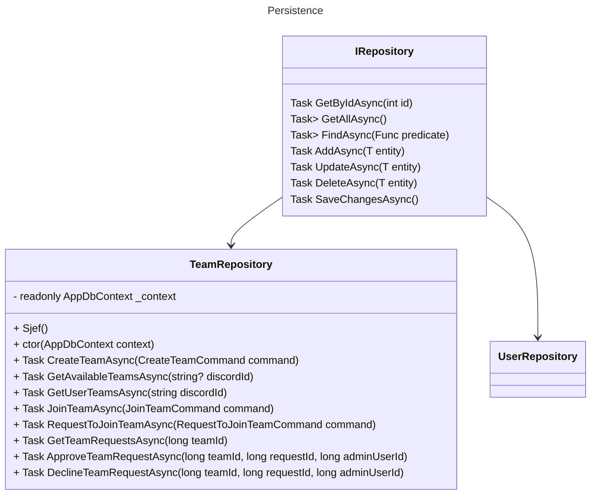

```mermaid

---
title: Persistence
---

classDiagram
    IRepository --> TeamRepository
    IRepository --> UserRepository
    
    class IRepository {
        Task<T?> GetByIdAsync(int id)
        Task<IEnumerable<T>> GetAllAsync()
        Task<IEnumerable<T>> FindAsync(Func<T, bool> predicate)
        Task AddAsync(T entity)
        Task UpdateAsync(T entity)
        Task DeleteAsync(T entity)
        Task SaveChangesAsync()
    }
    
    class TeamRepository {
        - readonly AppDbContext _context
        + Sjef()
        + ctor(AppDbContext context)
        + Task CreateTeamAsync(CreateTeamCommand command)
        + Task GetAvailableTeamsAsync(string? discordId)
        + Task GetUserTeamsAsync(string discordId)
        + Task JoinTeamAsync(JoinTeamCommand command)
        + Task RequestToJoinTeamAsync(RequestToJoinTeamCommand command)
        + Task GetTeamRequestsAsync(long teamId)
        + Task ApproveTeamRequestAsync(long teamId, long requestId, long adminUserId)
        + Task DeclineTeamRequestAsync(long teamId, long requestId, long adminUserId)
    }
    
    class UserRepository {

    }
```