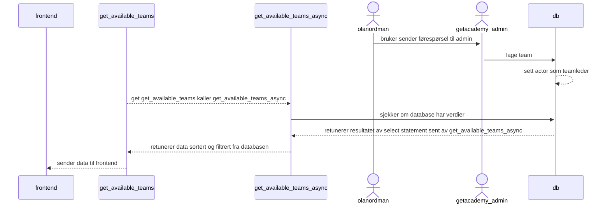

```mermaid 
sequenceDiagram
 participant fd as frontend 
 participant gat as get_available_teams 
 participant gata as get_available_teams_async
 actor a as olanordman
 actor b as getacademy_admin
 a->>+b : bruker sender førespørsel til admin 
 b->>db: lage team
 db-->>db: sett actor som teamleder
  gat-->>gata: get get_available_teams kaller get_available_teams_async
 gata->>+db: sjekker om database har verdier
 db-->>gata: retunerer resultatet av select statement sent av get_available_teams_async
 gata-->>gat: retunerer data sortert og filtrert fra databasen
 gat-->>fd: sender data til frontend
```
